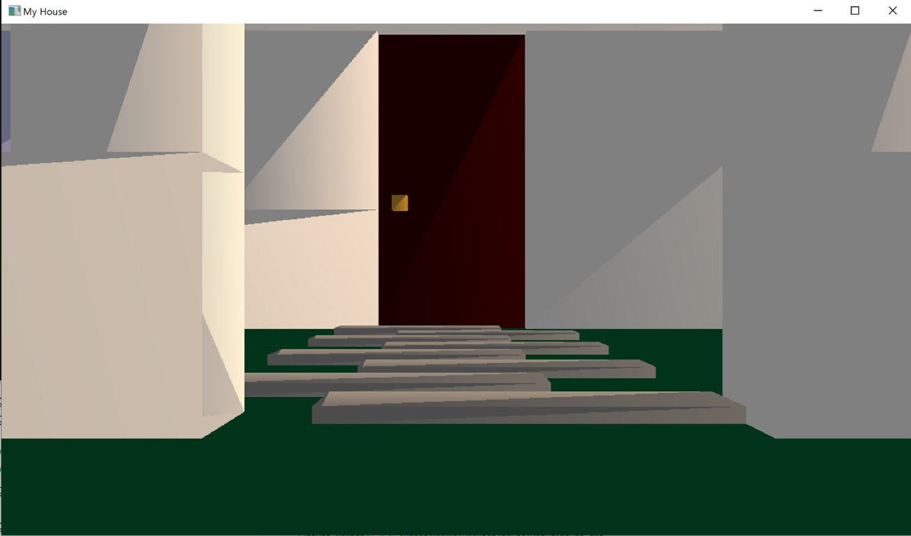
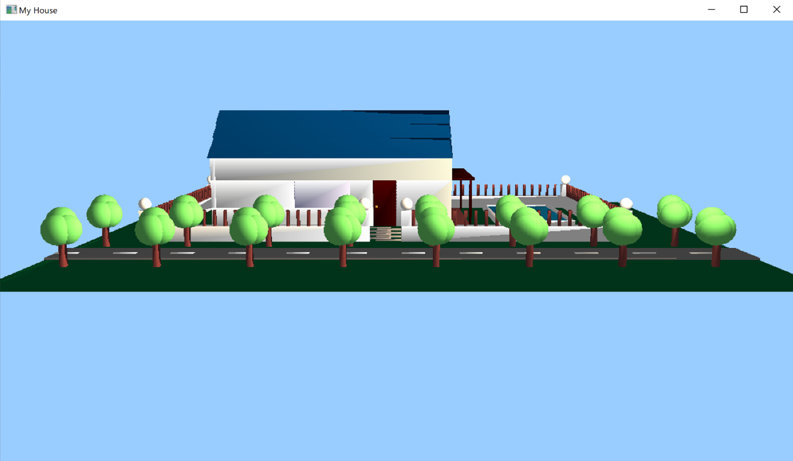
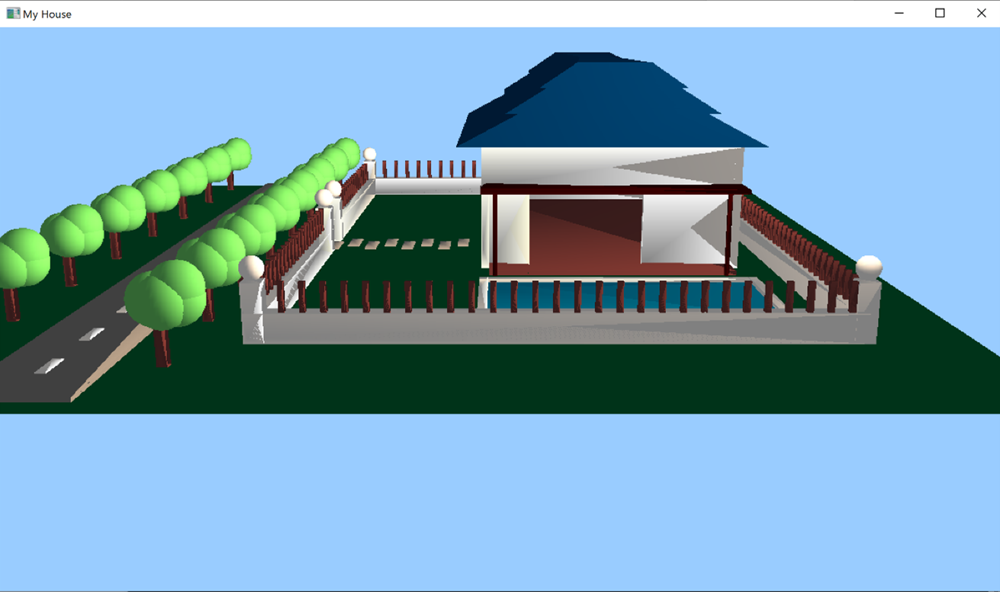
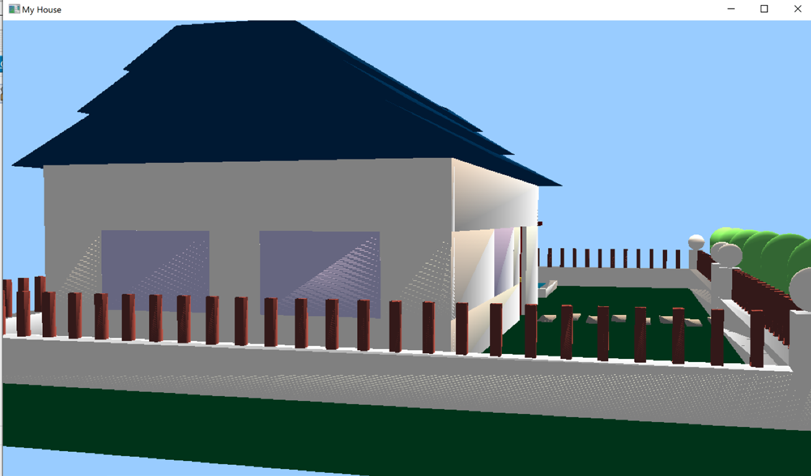
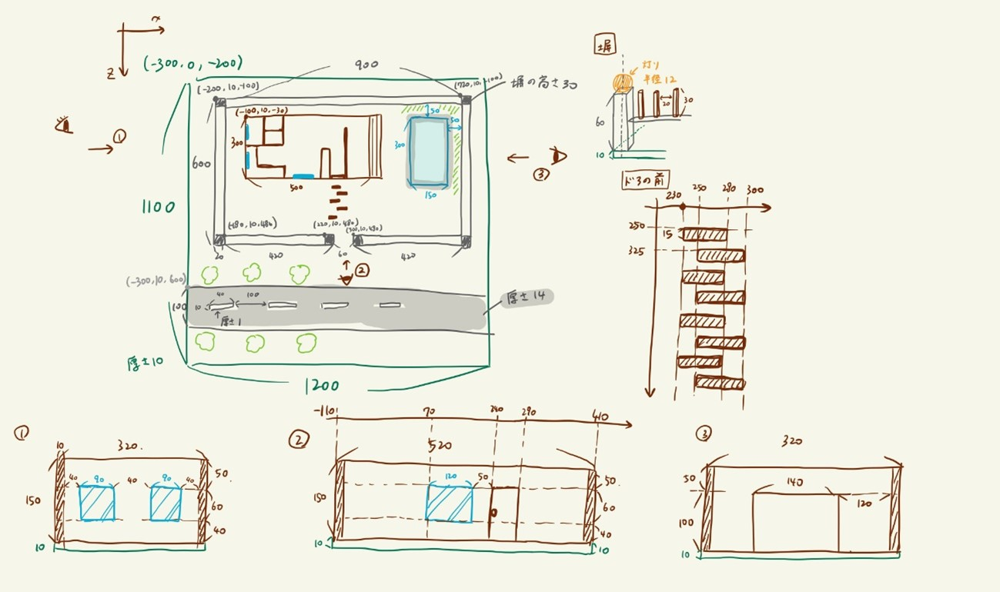

# A house made by OpenGL

一軒家のモデルを作成し，キーボードを通じて視点を移動(W,A,S,D)/拡大縮小(1,2)/回転(↑↓←→)できるようにしました．
大学の講義で制作しました．

## 制作時期
2020年8月

## OS
Windows 10

## 開発環境
Visual studio 2019

## 実際の画像
初期状態：

正面：

右側面：

左側面：

デザイン図：
